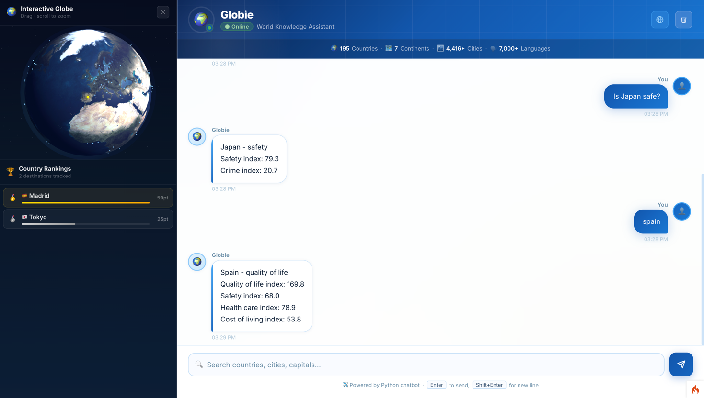

# Globie — Travel Chatbot with Interactive 3D Globe

> A conversational assistant that answers questions about cities and countries, with a live 3D globe that visualizes recommendations in real time.

<!-- IMAGEN PRINCIPAL -->



---

## What it does

Globie lets you ask natural-language questions about travel destinations and get structured answers:

- **City info** — culture, safety, cost of living, healthcare, pollution
- **Country comparisons** — "Russia vs China healthcare"
- **Personalized recommendations** — "best city for food and nightlife under $50/day"
- **Rankings** — "top 10 safest countries", "cheapest cities in Europe"

As the chatbot replies, an interactive 3D globe lights up the recommended locations with animated markers and a live ranking panel.

## Tech stack

| Layer | Technology |
|---|---|
| Web framework | PHP 8.4 + CodeIgniter 4 |
| Web server | Nginx (Alpine) |
| Chatbot engine | Python 3 + Flask (port 5000) |
| NLP | NLTK (tokenization, lemmatization, POS tagging) |
| Data processing | Pandas |
| Database | MySQL 8.4 |
| 3D Globe | Three.js |
| Containers | Docker + Docker Compose |

## Architecture

```
Browser ──► Nginx ──► CodeIgniter (PHP)
                            │
                            └──► Python Flask (/chat)
                                      │
                                 chatbot_rules.py   (intent detection)
                                 chatbot_data.py    (city/country data)
                                 chatbot_responses.py
```

The PHP controller calls the Python microservice via HTTP and forwards the JSON response to the frontend. The globe updates in real time with each chatbot reply.

## Getting started

### Requirements

- Docker and Docker Compose

### Run

```bash
docker-compose up -d
```

| Service | URL |
|---|---|
| App | http://localhost:3380 |
| phpMyAdmin | http://localhost:3381 |

### Stop

```bash
docker-compose down
```

## Project structure

```
globie/
├── www/
│   └── app/
│       ├── Controllers/
│       │   └── ChatbotController.php
│       └── Views/               # Frontend templates
├── python/
│   ├── app.py                   # Flask entrypoint (/chat, /health)
│   ├── chatbot_rules.py         # Rule-based NLP and intent detection
│   ├── chatbot_data.py          # City and country dataset
│   ├── chatbot_responses.py     # Response generation
│   └── chatbot_utils.py         # Text normalization utilities
├── docker-compose/
│   ├── nginx/
│   ├── php/
│   └── mysql/
├── docker-compose.yaml
└── Dockerfile
```

## Local development (without Docker)

```bash
# PHP backend
php spark serve

# Python chatbot
python3 python/app.py
```

The chatbot runs on `http://localhost:5000` and the PHP app expects it there.
